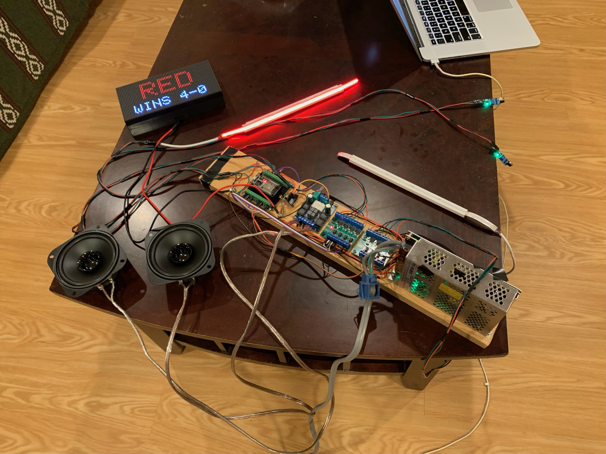
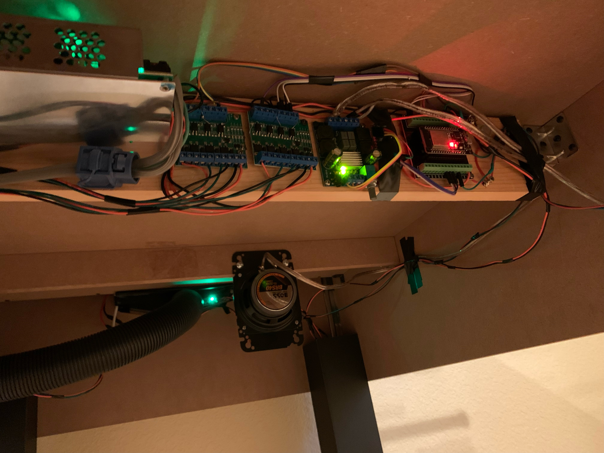
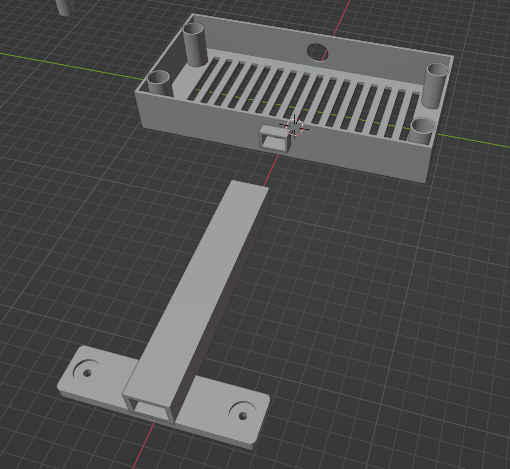

# ESP32 foosball

Add ligths, voices and a scoreboard to your foosball table.


## How it works

There are two parts on this project:
* The control to sense for goals, play audio files and control the LED goal ligths. This runs on a ESP32 microcontroller running [ESPHome](https://esphome.io).
* The scoreboard. Another ESP32 controlling an LED matrix display but running an arduino schetch.

### The control (ESPHome)

An ESP32 microcontroller running [ESPHome](https://esphome.io) that controls:
* The sensors to detect when a goal is scored. An infrared obstacle avoidance sensor detects when the ball passes thru the return tube. I've used [this](https://www.amazon.com/dp/B07PFCC76N?ref=ppx_yo2ov_dt_b_product_details&th=1) one
* To play recordeded audio files an I2S DAC Decoder is used. I've used this [I2S PCM5102 DAC Decoder GY-PCM5102](https://www.amazon.com/dp/B07W97D2YC?psc=1&ref=ppx_yo2ov_dt_b_product_details) with [this](https://www.amazon.com/dp/B08GYQTTXF?psc=1&ref=ppx_yo2ov_dt_b_product_details) audio amplifier.
* The goal ligths are two small RGB LED strips. As they are 24v (to be bright), they are controlled with an array of MOSFET transistors. I've used one of this [driver module](https://www.amazon.com/dp/B08SJQTQ4Y?ref=ppx_yo2ov_dt_b_product_details&th=1) per LED strip. NORE: even Amazon page claims it can be triggered with 3v, that was not the case for me. I've had to solder a parallel resistor (39 Ohm) to drive more current to the optocupler diode to be triggered. I've used this high density [RGB LED strip](https://www.amazon.com/dp/B0B318XGWP?ref=ppx_yo2ov_dt_b_product_details&th=1). 

The ESPHome yaml file for the controler is [foosball.yaml](./foosball.yaml)

### The scoreboard

Another ESP32 microcontroller, but this one runs an Arduino sketch to control the display matrix:
* I've used this [RGB LED Matrix Panel 64×32](https://www.amazon.com/dp/B09MB426K5?ref=ppx_yo2ov_dt_b_product_details&th=1) panel using this nice lib [ESP32-HUB75-MatrixPanel-I2S-DMA.h](https://github.com/Tonio5978/ESP32-HUB75-MatrixPanel-I2S-DMA) and some code from the [morphing clock](https://github.com/bogd/esp32-morphing-clock) project.
* It runs an HTTP server with a simple API to control the display.

The source code is in the [foosball_display](./foosball_display) folder.

## Interfaces
* The ESP32 control part runs a client HTTP to communicate with the scoreboard which acts as an HTTP server. The API requests are:
  * `POST http://<SCOREBOARD_IP>/reset` resets the score board
  * `POST http://<SCOREBOARD_IP>/goal?team=blue` to increment the blue side score (or red with `team=red`). The 200 response body includes the current scores as json, like:
  ```{ red: 7, blue: 10 }```
  * `POST http://<SCOREBOARD_IP>/win?team=blue` to display the blue team wins (or red with `team=red`)

* The ESP32 control plays the audio files hosted in Home Assistant, but could be any HTTP server. Audio files should be .wav mono sampled at 22kHz (higher frequency and stereo files did not sound good in my tests)

## 3D printed parts
I've used [blender](https://www.blender.org) to create the 3D models and a Creality 3D printer:
* [foosbal_scoreboard.blend](./foosbal_scoreboard.blend) Scoreboard display matrix case and support.
* [foosball_light_support.blend](./foosball_light_support.blend) The LED strip support.

## Pics




